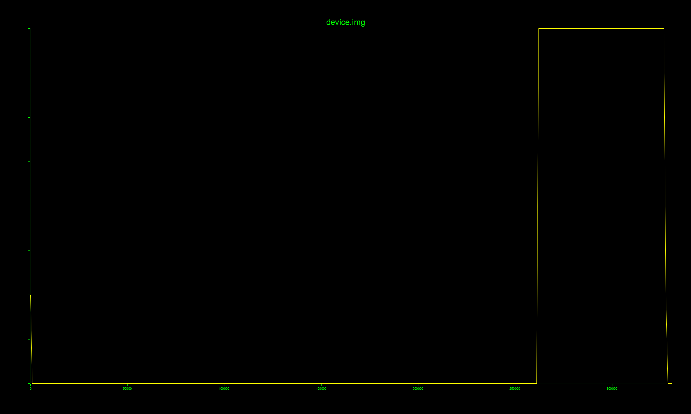

# 高级工具与逆向专题-Binwalk工具使用-G4 WriteUp

通过熵值分析`device.img`

```bash
binwalk -E device.img
```

获得了熵值图：



发现在`250000`之后的熵值极高，说明该区域可能是加密数据。

通过切片提取出`device.img`中`250000`之后的内容：

```bash
dd if=device.img of=encrypted_data.bin bs=1 skip=250000
```

用`cat`命令查看`encrypted_data.bin`内容发现末尾存在明文：

```
{
  "device_id": "AT7000-XK-2024",
  "region": "CN",
  "hw_rev": "3.1",
  "decrypt_key": "3f8a2c1d7e4b9f5a0c6d2e8f1b7a4c3d9e5f2b8a0d6c4e1f7a3b9d5c2e8f4b1a",
  "checksum": "d41d8cd98f00b204e9800998ecf8427e"
}
```

通过``decrypt_key`可以尝试解密数据。

最终确认加密方式为`AES-256-ECB`

```python
from pathlib import Path
import re

from Crypto.Cipher import AES

INPUT_FILE = Path(r"./encrypted_data.bin")
OUTPUT_FILE = Path(r"./decrypted_data.bin")
HEX_KEY = (
    "3f8a2c1d7e4b9f5a0c6d2e8f1b7a4c3d9e5f2b8a0d6c4e1f7a3b9d5c2e8f4b1a"
)

def decrypt_and_extract_flag() -> str:
    payload = INPUT_FILE.read_bytes()

    if len(payload) % AES.block_size != 0:
        raise ValueError("密文区长度不是 AES 块大小的整数倍")
    # AES-256 解密
    key = bytes.fromhex(HEX_KEY)
    if len(key) != 32:
        raise ValueError("密钥不是有效的 AES-256 密钥")
    plaintext = AES.new(key, AES.MODE_ECB).decrypt(payload)
    OUTPUT_FILE.write_bytes(plaintext)
    # 正则匹配 flag{} 格式
    match = re.search(rb"flag\{[^}\r\n]+\}", plaintext)
    if match is None:
        raise ValueError("解密结果中未找到 flag")

    return match.group(0).decode("ascii")

if __name__ == "__main__":
    flag = decrypt_and_extract_flag()
    print(f"FLAG: {flag}")
    print(f"解密文件: {OUTPUT_FILE}")
```